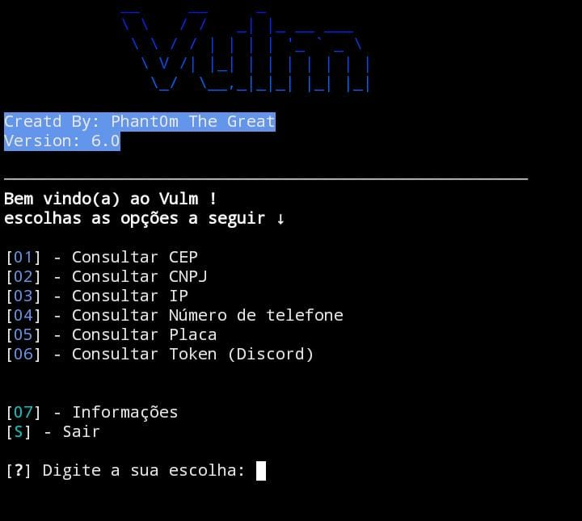

  
  
# 🛰️ Vulm
Vulm, uma ferramenta criada para otimizar a coleta de informações.

## 🧪 Testado em...
 > - - [X] **KALI LINUX** 

 > - - [x] **TERMUX** 

## 🔧 Instalação no Kali Linux e Termux

 - `git clone https://github.com/Phant0mthegreat/Vulm/`

 - `cd Vulm`
   
 - `bash install.sh`

## 💉 Iniciar
Use o comando ↓
 - `python3 Vulm.py`
para iniciar o programa quando quiser

## 🗃️ Versão Atual: 6.0
1.0 = ??/??/????

2.0 = ??/??/????

3.0 = 28/08/2023

4.0 = 31/08/2023

5.0 = 15/10/2023

5.7 = 20/10/2023

6.0 = 18/11/2023
## 📜 Nota
Para que a instalação funcione, é preciso ter o "git", a línguagem python e o "pip" instalados.
