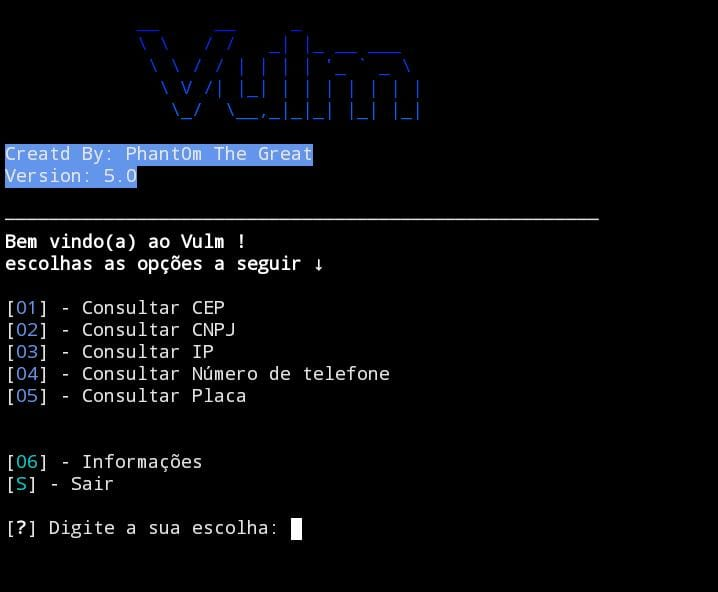

  
  
# 🛰️ Vulm
Vulm, uma ferramenta criada para otimizar a coleta de informações.

## 🧪 Testado em...
 > - - [ ] **KALI** 

 > - - [x] **TERMUX** 

## 🔧 Instalação no Termux

 - `git clone github.com/Phant0mthegreat/Vulm/`

 - `cd Vulm`
   
 - `pip install -r requirements.txt`

## 💉 Iniciar
Use o comando ↓
 - `python3 Vulm.py`
para iniciar o programa

## 🗃️ Versão Atual: 5.7
1.0 = ??/??/????

2.0 = ??/??/????

3.0 = 28/08/2023

4.0 = 31/08/2023

5.0 = 15/10/2023
## 📜 Nota
Para que a instalação funcione, é preciso ter o "git", a línguagem python e o "pip" instalados.
